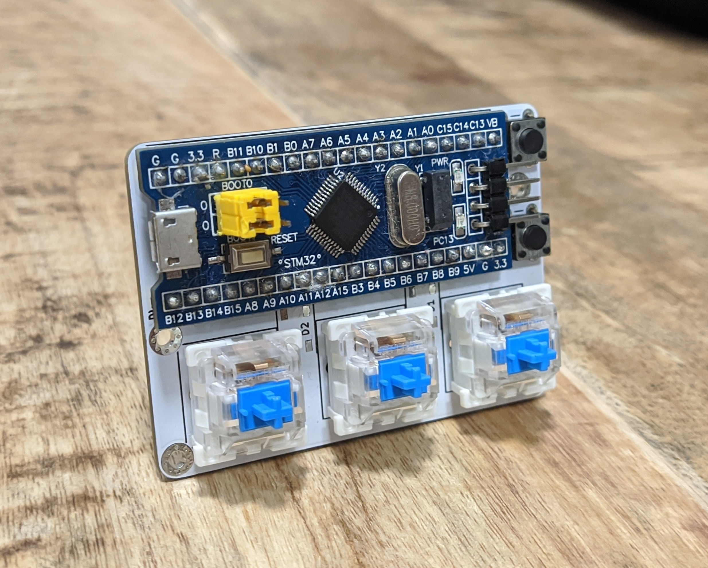
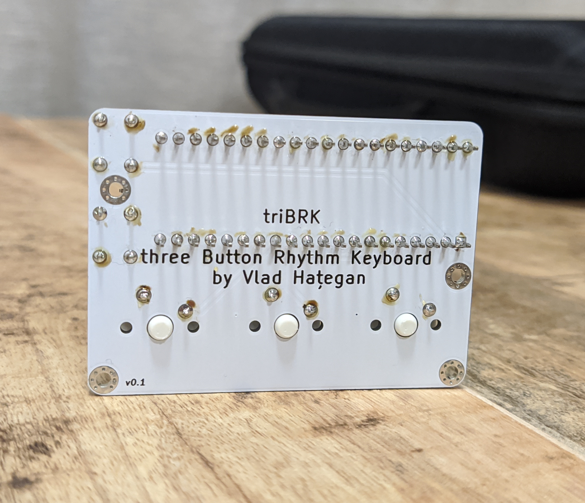

# triBRK
<b>three Button Rhythm Keyboard</b> is a cheap and simple to produce input device for various rythm games, aiming to fill the niche of three button devices.

This is my first project both in KiCAD and in STM32Cube.

### Hardware

Built around a STM32 "blue-pill", it uses cheap commonly available parts and a 3D printed case. Unlike AVR-based alternatives this is even cheaper, as blue-pills are around 2-3 euros on Chinese websites. Initial designs had a STM32 chip and the auxilliary components placed directly on the board but compared to just soldering a pre-made board this reusulted in useless complexity, longer building times and surprisingly, higher costs per unit.

### Images

  
  &nbsp&nbsp&nbsp&nbsp&nbsp
  

### To be done

Even though the project is functional, there are still a lot of things that are left to be done:

* Implement an easy to use key programming method using the additional microswitches.
* Add properly implemented RGB LED functionality.
* Create variant with hot-swappable switch connectors.
* Make 3D printed case.

### How to make one

#### What you need

* A blue-pill STM32F103C6T6A board.
* A ST-Link (I have used a clone) and jumpers.
* A program to flash the board, for Linux I have used [this](https://github.com/stlink-org/stlink).
* Three mechanical switches of your choice, compatible with the MX switch layout, prefferably of the 5 pin variety.
* Two standard THT microswitches/buttons.
* A PCB ordered by using the provided Gerber files.

#### How to assemble

* Order the PCB from a custom manufacturer and wait for it to arrive (I have used JLCPCB, any alternative is just as good).
* If blue-pil does not come with soldered jumpers, solder the jumpers.
* Solder the two small microswitches and the three switches to the board.
* Solder the blue-pill on the board.
* Connect the blue-pill to your PC via the ST-Link.
* Flash it with the .bin available in Releases.
* Enjoy your new device!

### Thanks to:

* This library for the blue-pill footprint: https://github.com/Mr-JoE1/Kicad-STM32_bluebill
* This library for MX switches footprint: https://github.com/perigoso/keyswitch-kicad-library
* STM for the USB HID libraries that are included with STM32CubeIDE.
* [This](https://www.instructables.com/STM32-As-HID-USB-Keyboard-STM32-Tutorials/) guide for helping me navigate the Configuration interface of the IDE for the first time and explaining how to modify the generated code from the default mouse behaviour to a keyboard one.
